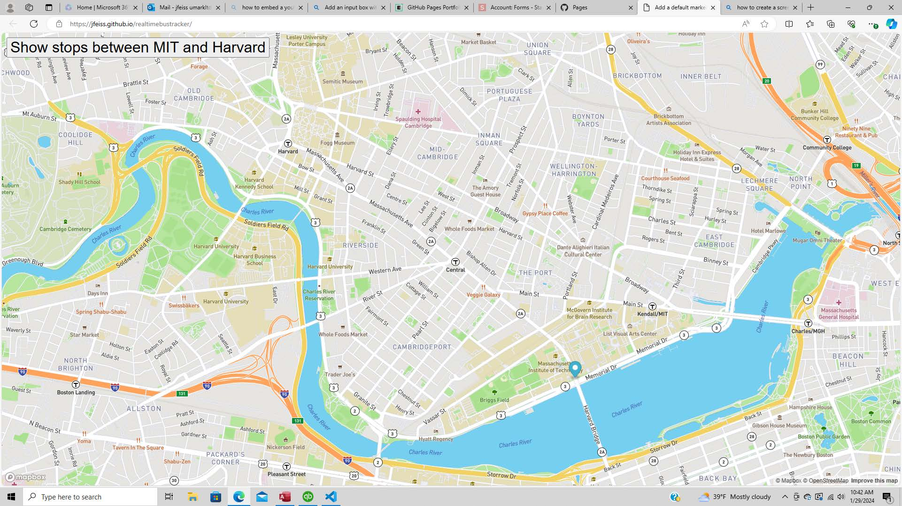

# Realtimebustracker
<h2> This project tracks a bus route with each individual stops from MIT to Harvard using markers to denote each stop. 
This program can be used by public(MTA's) or private organizations(FedEx, UPS) to track mobile assets on a real-time basis 
</h2>

